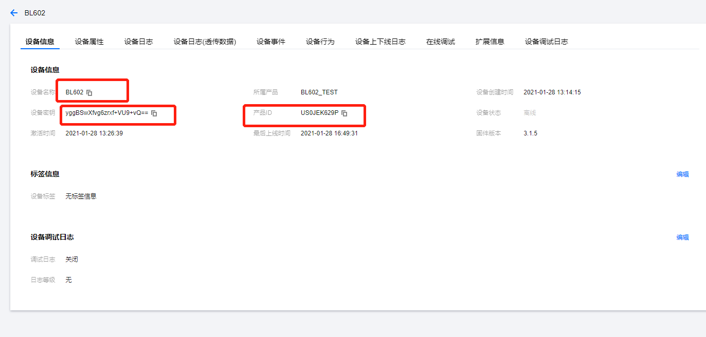

# BL602 IoT Device Access Tencent Cloud

1.设备配网

如何使用此例程请参考目录下的[用户手册](BLE_Use_ Manual.pdf)进行BLE配网或者使用wifi_sta_connect的命令行配置。

2.腾讯云平台接入

此demo已经完成了腾讯云平台的接入，用户只需要修改腾讯三元组即可，配置好在配网之后发送tencent命令即可运行。

sg_product_id : product Id

sg_device_name : device name

sg_product_secret : product secret for device dynamic Registration

这三个信息可以在云平台的设备信息里面查到：

如何构建一个产品和具体上报信息json适配可以参考腾讯云平台的接入文档：

腾讯云官方文档：[腾讯云]：https://cloud.tencent.com/document/product/1081/44921

此工程的使用的Sensor芯片为北京中科银河芯科技的GXHT3X Humidity and Temperature Sensor。

北京中科银河芯科技有限公司是依托中国科学院微电子研究所雄厚的人才和科研技术资源成立的技术创新驱动型企业；公司面向汽车电子、智能制造、物联网、工业领域、消费电子领域的产业需求，致力于温度、湿度、水分、压力、电子标签等传感芯片设计、开发、销售并提供相关技术咨询和技术服务。如需了解更多请访问：http://gxcas.com/

