# BL808 IOT SDK

## Setup

1. Download sdk

    ```shell
    mkdir ~/bl808 && cd ~/bl808
    git clone https://github.com/bouffalolab/bl_iot_sdk.git
    git checkout bl808
    ```
    
2. Download toolchain [here](https://occ-oss-prod.oss-cn-hangzhou.aliyuncs.com/resource//1663142243961/Xuantie-900-gcc-elf-newlib-x86_64-V2.6.1-20220906.tar.gz) . Extract it to `toolchain/riscv/Thead_riscv/` and rename to  `Linux_x86_64` 

    ```shell
    cd ~/bl808 && mkdir -p bl_iot_sdk/toolchain/riscv/Thead_riscv
    
    mv {your_download_path}/Xuantie-900-gcc-elf-newlib-x86_64-V2.6.1-20220906.tar.gz ~/bl808
    tar -zxvf Xuantie-900-gcc-elf-newlib-x86_64-V2.6.1-20220906.tar.gz -C bl_iot_sdk/toolchain/riscv/Thead_riscv/
    
    cd bl_iot_sdk/toolchain/riscv/Thead_riscv && mv Xuantie-900-gcc-elf-newlib-x86_64-V2.6.1/ Linux_x86_64 && cd -
    ```

3. Build the uvc example

    ```shell
    # Compile e907 firmware
    cd ~/bl808/bl_iot_sdk/customer_app/bl808/bl808_demo_uvc_sd

    ./genromap

    # Compile c906 firmware
    cd ~/bl808/bl_iot_sdk/customer_app/bl808/bl808_demo_mm

    ./genromap
    ```

4. The compilation is complete, and the target file is saved in the `build_out` path

##  Flash Guide

1. Startup flash tool

    - Ubuntu
    ```shell
    cd ~/bl808/bl_iot_sdk/tools/flash_tool

    # startup
    ./BLDevCube-ubuntu &> /dev/null &
    ```
    - Windows

      execute `BLDevCube.exe`

2. Download bl808 firmware

    - Use the type-c usb cable to connect from the PC side to the UART port of the board

    - Startup `BLDevCube Tools` and choose `BL808` chip

    - Configure the tool according to the label below, finally click `Create & Download` will start to download firmware

        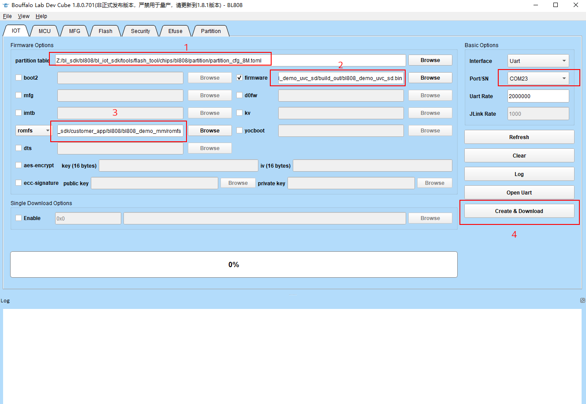


3. About partition table files

    The partition table of bl808 is written in toml file format. You can specify the flash size used by the firmware by modifying the partition table.

    The default partition table is provided in the bl808/bl_iot_sdk/tools/flash_toolchips/bl808/partition/ directory, and you can also create your own partition table.

##  Start Run

1. press reset and you can get log from dual serial default baud rate `2000000`

     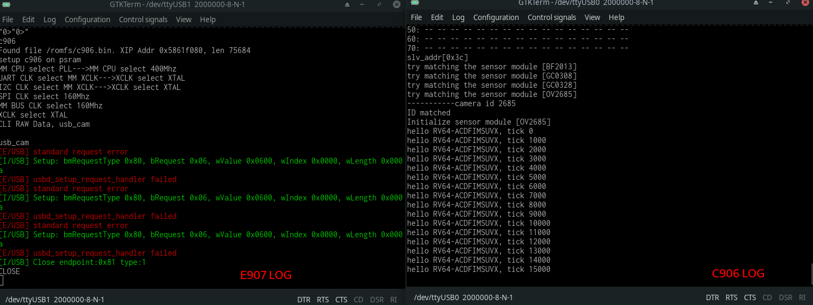

2. Use the type-c usb connect tag ota to PC and run camera on PC you can get image from sensor

     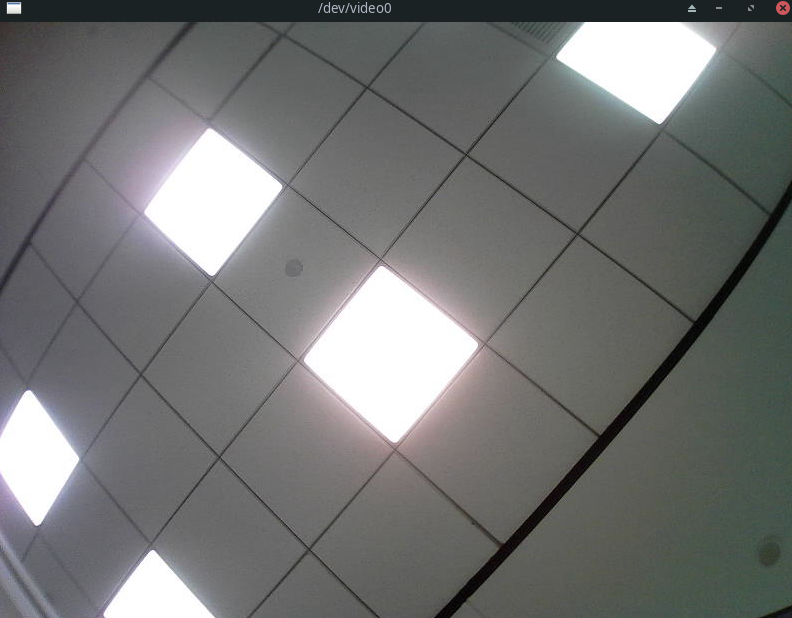

##  Wifi Demo

1. Use bl808_demo_evnet 

    ```shell
        # Compile bl808_demo_event firmware
        cd ~/bl808/bl_iot_sdk/customer_app/bl808/bl808_demo_event

        ./genromap
    ```
    - NOTE:this demo no need use c906 firmware

2. Download firmware use flash tool please follow refer to the above [Flash Guide](#flash-guide)

3. Open serial port and config baud rate`2000000` next press reset button you can get next info

     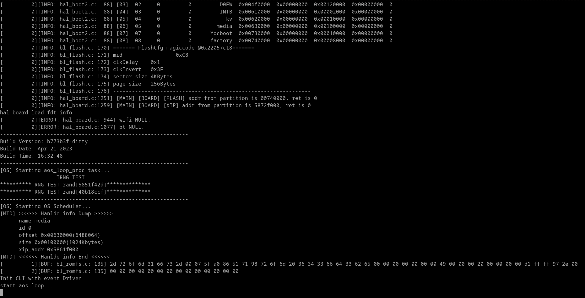

4. Input `stack_wifi`serial port terminal to start wifi stack and get next info is OK 

     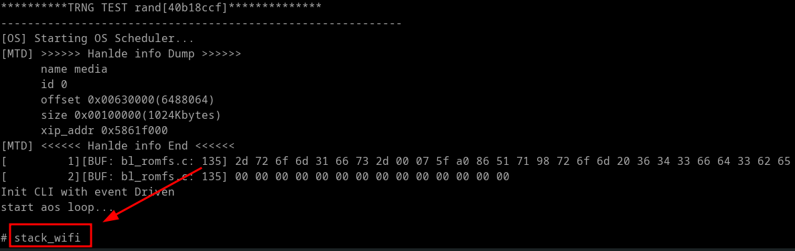

     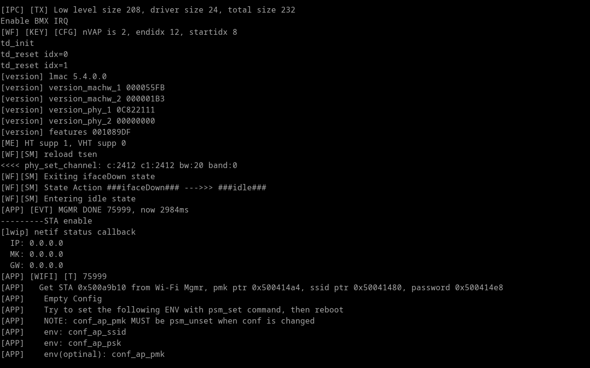

5. Input `wifi_sta_connect <ssid> <key>` to connect AP

     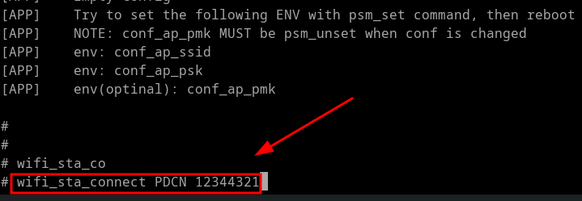

6. If connected successfully you can get ip info

     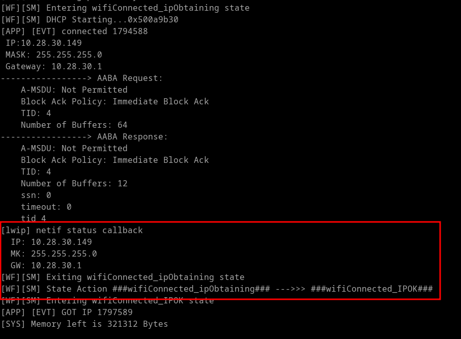

7. Start iperf server on PC eg. Linux 
    
    ```shell
        iperf -s -i 1
    ```
    
     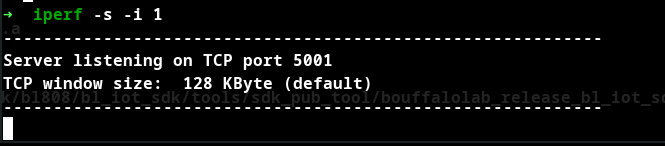

8. Input `ipc <yourserver-ip>` on serial port terminal start tcp tx iperf

     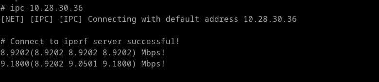

     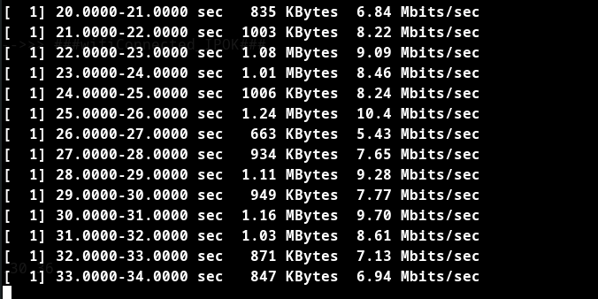